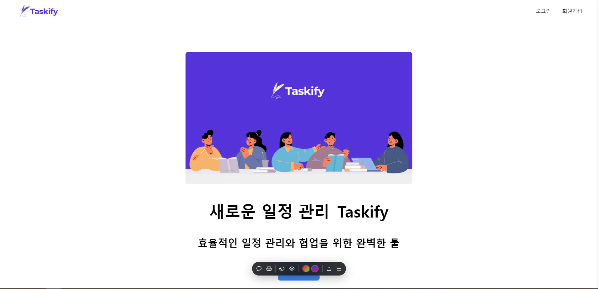
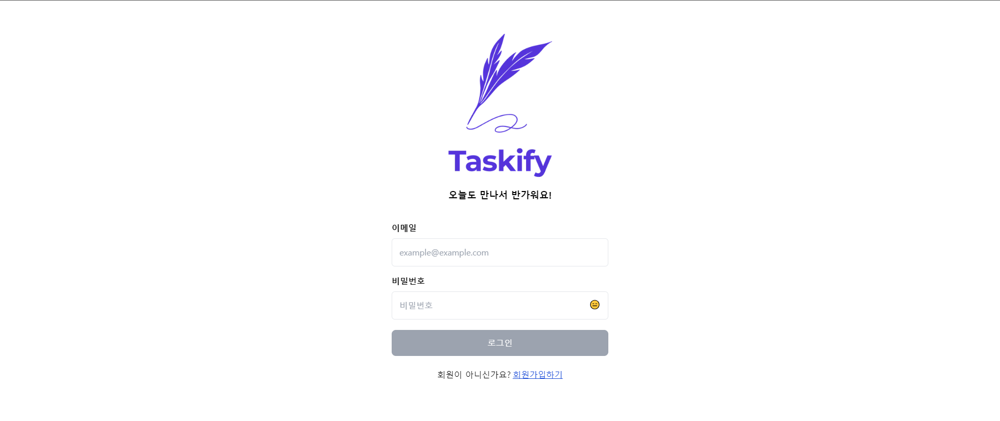

# 💌 Taskify by Team 14

자신의 

> 코드잇 스프린트-프론트엔드 4기 PART3 - 14팀 
> 개발기간: 2024. 04. 15 ~ 2024. 04. 30
> 

배포 URL : https://taskify-psql7osvb-sprint-part3-team14.vercel.app/

## 💡 프로젝트 소개

- Taskify는 누구나 쉽게 자신의 일정을 만들고 관리할 수 있는 페이지 입니다.
- 대시보드 생성을 통해 원하는 대시보드를 만들고 카드로 일정을 관리 할 수 있습니다.
- 원하는 사람을 초대하여 일정을 공유할 수 있습니다.

## 👨‍👩‍👧‍👧 팀원 소개

<table>
  <tbody>
    <tr>
      <td align="center"><a href="https://github.com/TaeUk471">
       
      <b>[FE] 한태욱</b></a> </td>
      <td align="center"><a href="https://github.com/kkh000">
       
      <b>[FE] 김규헌</b></a> </td>
      <td align="center"><a href="https://github.com/codingaring">
       
      <b>[FE] 김유경</b></a> </td>
    </tr>
  </tbody>
</table>

## ⚙️ 기술 스택
**✅ 개발 환경**

**✅ 협업**

**✅ Front-End**

**✅ 라이브러리**

## 🧩 역할 분담

### 😏 한태욱

- **UI**
  - 공통 컴포넌트 : Button, 대시보드 헤더, 대시보드 사이드바
  - 페이지 : 랜딩 페이지, 로그인 / 회원가입 페이지 (/signin, /signup)
- **기능**
  - 로그인 및 회원가입 기능, 멤버 리스트 불러오기, 대시보드 목록 불러오기 기능

### 😚 김규헌

- **UI**
  - 공통 컴포넌트 : 페이지 네이션, 검색 바
  - 페이지 : 초대 페이지(/myinvitation), 대시보드(/dashboard)
- **기능**
  - 페이지 네이션 기능, 검색 기능, 무한 스크롤 기능(카드, 댓글), 카드 위치 전환 (드래그 앤 드랍)

### 🤩 김유경

- **UI**
  - 공통 컴포넌트 : 페이지 네이션, 전체 모달
  - 페이지 : 대시보드 수정 페이지(dashboard/{dashboardid}/edit), 404 페이지(/account-menu)
- **기능**
  - 대시보드 수정 기능 모달, 대시보드 멤버 추가 기능 모달, 계정 관리 페이지 유효성 검사, 이미지 불러오기 기능

## 🎲 페이지별 기능

### 1. 홈페이지

  - Taskify의 역할 및 내용에 대해서 알 수 있습니다.
  - 로그인 버튼을 통해 로그인 / 회원가입 버튼을 통해 회원가입이 가능합니다.

### 2. 로그인 / 회원가입 페이지

  - 로그인과 회원가입을 할 수 있습니다.
  - 유효성 검사를 통해서 조건에 맞지 않는 것들은 걸러 냅니다.

### 3. 대시보드 페이지

  - 대시보드를 제작할 수 있습니다.
  - 대시보드내의 카드와 칼럼을 드래그 & 드랍을 통해서 원하는 곳이로 이동시킬 수 있습니다.
  - 초대를 통해서 해당 일정을 공유할 수 있습니다.
  - 댓글을 달 수 있어 해당 카드에 대해서 의견을 공유할 수 있습니다.
  - 원하는 사용자를 초대할 수 있습니다. 

### 4. 대시 보드 수정 페이지

  - 대시보드의 이름을 변경할 수 있습니다.
  - 구성원을 목록에서 삭제할 수 있습니다.
  - 초대 내역을 통해 초대를 보낸 이력을 삭제하거나 다른 사용자를 초대할 수 있습니다.

### 5. 계정 관리 페이지

  - 사용자의 프로필, 닉네임을 변경할 수 있습니다.
  - 비밀번호 변경이 가능합니다.

### 6. 404 페이지

- 존재하지 않는 url에 접근했을 경우 해당 페이지가 보여집니다.
- 데이터가 존재하지 않는 ID의 대시보드에 url로 직접 접근했을 시 해당 페이지로 연결됩니다.

## 💣 트러블 슈팅

### 😏 한태욱

  - Trouble : 
  - Shooting : 

### 😚 김규헌

  - Trouble : 
  - Shooting : 

### 🤩 김유경

  - Trouble :  
  - Shooting : 

## 🍔 프로젝트 후기

### 😏 한태욱

후기를 작성해주세요.

### 😚 김규헌

후기를 작성해주세요.

### 🤩 김유경

후기를 작성해주세요.
